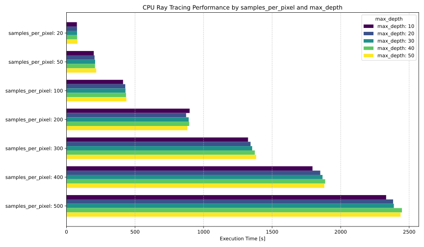
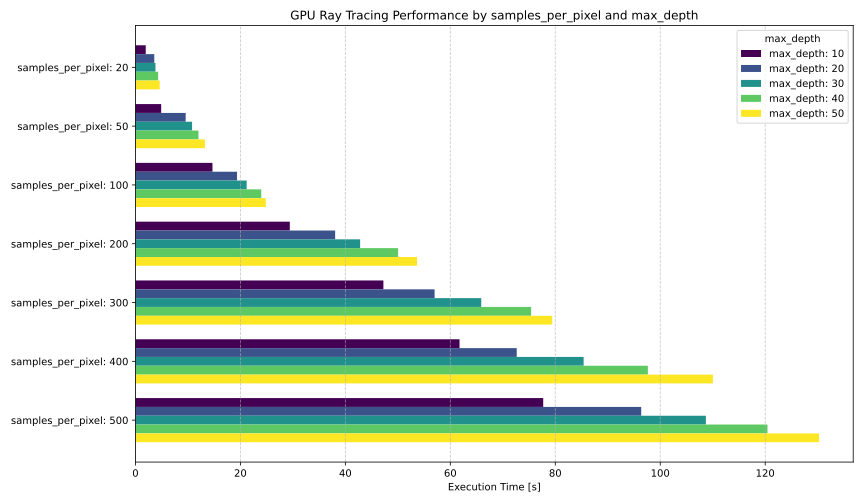
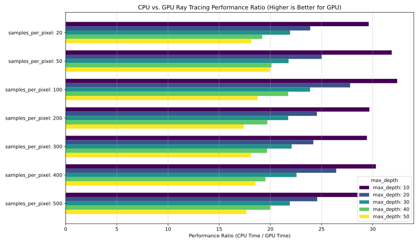
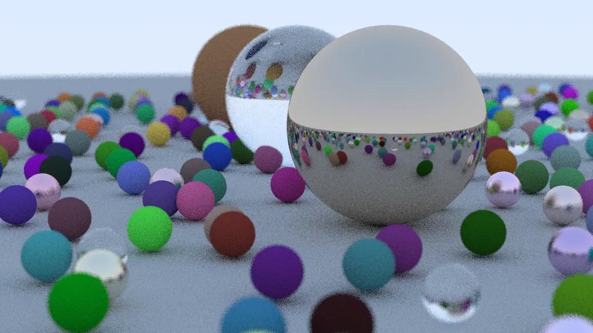

# Ray Tracing in One Weekend in CuPy
This repository implements ray tracing techniques from version 4.0.2 of "[Ray Tracing in One Weekend](https://raytracing.github.io/books/RayTracingInOneWeekend.html)" using CUDA and CuPy's RawModule for GPU acceleration.
For details on CuPy's RawModule, refer to the author's [Getting Started with CUDA using CuPy](https://github.com/eshibusawa/CuPy-CUDA).

- [Outputting an Image](#outputting-an-image)
- [Rays, a Simple Camera, and Background](#rays-a-simple-camera-and-background)
- [Adding a Sphere](#adding-a-sphere)
- [Surface Normals and Multiple Objects](#surface-normals-and-multiple-objects)
- [Moving Camera Code Into Its Own Class](#moving-camera-code-into-its-own-class)
- [Antialiasing](#antialiasing)
- [Diffuse Materials](#diffuse-materials)
- [Metal](#metal)
- [Dielectrics](#dielectrics)
- [Positionable Camera](#positionable-camera)
- [Defocus Blur](#defocus-blur)
- [Where Next?](#where-next)
- [Performance Analysis](#performance-analysis)
- [Important Note](#important-note)

<figure style="padding: 15px; display: inline-block;">
  
  <figcaption style="text-align: center; margin-top: 10px; font-size: 0.9em; color: #555;">
    Fig. 1: the final rendering result
  </figcaption>
</figure>

## Outputting an Image
The author's implementation of image generation in this chapter significantly deviates from the book's C++ approach by leveraging CuPy's RawModule for GPU acceleration.
Instead of writing a C++ application that outputs to `std::cout`, the image dimensions are directly embedded as compile-time constants within the CUDA kernel.
The resulting image data is then processed and displayed inline within a Jupyter Notebook (`.ipynb`) environment, providing immediate visual feedback without external file redirection.
As shown in Fig. 2, this chapter demonstrates the initial image output.

<figure style="padding: 15px; display: inline-block;">
  
  <figcaption style="text-align: center; margin-top: 10px; font-size: 0.9em; color: #555;">
    Fig. 2: the rendering result of chapter 2.
  </figcaption>
</figure>

The implementation for this chapter is available in the `chapter02` branch.
```sh
git checkout -b chapter02 origin/chapter02
```

## Rays, a Simple Camera, and Background
The author's implementation for this chapter achieves significant optimization by leveraging CUDA to compute all pixels simultaneously on the GPU.
Rather than the book's sequential C++ approach, each ray and its corresponding color are calculated in parallel across a grid of GPU threads.
To further enhance this parallel computation, common camera parameters such as `g_cameraCenter`, `g_pixelDeltaU`, `g_pixelDeltaV`, and `g_pixel00Loc` are uploaded once to CUDA's constant memory via a custom `upload_constant` utility.
This provides fast, cached, read-only access for all threads, efficiently feeding the parallel ray generation.
The `ray_color` function, which determines the background gradient, is also implemented as a `__device__` function within the CUDA kernel, operating directly on the GPU for maximum throughput.
The rendering result of this chapter is depicted in Fig. 3.

<figure style="padding: 15px; display: inline-block;">
  
  <figcaption style="text-align: center; margin-top: 10px; font-size: 0.9em; color: #555;">
    Fig. 3: the rendering result of chapter 4.
  </figcaption>
</figure>

The implementation for this chapter is available in the `chapter04` branch.
```sh
git checkout -b chapter04 origin/chapter04
```

## Adding a Sphere
In the author's implementation, the ray-sphere intersection logic is fully integrated into the CUDA kernel.
The `hit_sphere` function, which performs the quadratic equation discriminant check, is implemented as a `__device__` function, allowing it to be called efficiently by each GPU thread processing a pixel.
The `ray_color` function now includes a conditional check: if a ray hits the hardcoded sphere, it returns red; otherwise, it falls back to the background gradient logic from the previous chapter.
All vector operations (`dot`, `+`, `-`, `*`, `/`, `unit_vector`) essential for ray and sphere calculations are implemented as `__device__` functions directly within the CUDA C++ kernel files (`vec3.cuh`, `ray.cuh`, `render.cu`), ensuring that all computations remain entirely on the GPU for maximum parallel performance.
Fig. 4 displays the rendering result for this chapter.

<figure style="padding: 15px; display: inline-block;">
  
  <figcaption style="text-align: center; margin-top: 10px; font-size: 0.9em; color: #555;">
    Fig. 4: the rendering result of chapter 5.
  </figcaption>
</figure>

The implementation for this chapter is available in the `chapter05` branch.
```sh
git checkout -b chapter05 origin/chapter05
```

## Surface Normals and Multiple Objects
The author's implementation diverges from the book's C++ `std::shared_ptr` and `std::vector` usage, adapting for CUDA.
A custom Python `world` class has been developed to manage GPU memory allocation and pointers for `hittable` objects and the `hittable_list`. On the CUDA side, `hittable` and `hittable_list` classes utilize `__device__` virtual functions for polymorphic behavior and manage raw `hittable` object pointer arrays.
All core logic—including simplified ray-sphere intersection, surface normal calculation, front-face determination, and interval checks—is implemented directly within `__device__` functions in the CUDA kernel, ensuring high-performance parallel computation for complex scenes entirely on the GPU.
The rendering result of this chapter is presented in Fig. 5.

<figure style="padding: 15px; display: inline-block;">
  
  <figcaption style="text-align: center; margin-top: 10px; font-size: 0.9em; color: #555;">
    Fig. 5: the rendering result of chapter 6.
  </figcaption>
</figure>

The implementation for this chapter is available in the `chapter06` branch.
```sh
git checkout -b chapter06 origin/chapter06
```

## Moving Camera Code Into Its Own Class
The author's implementation mirrors the refactoring by introducing a Python `Camera` class, which manages the CUDA kernel compilation and constant memory uploads.
The `Camera` class takes `CameraSettings` as input, calculates camera parameters (e.g., `image_height`, `viewport_width`), and then replaces placeholders in the CUDA source code (`RTOW_WIDTH`, `RTOW_HEIGHT`, `RTOW_FLT_MAX`) before compiling the `cp.RawModule`.

The `Camera.setup_module()` method handles the camera's initialization, including uploading camera-specific constant values to the GPU.
The `Camera.render()` method then dispatches the render CUDA kernel, passing the `img_gpu` array and the `world` object's device pointer.
This design cleanly separates the Python-side camera configuration and CUDA kernel management from the core ray tracing logic that remains on the GPU.
Fig. 6 illustrates the rendering result after this refactoring.

<figure style="padding: 15px; display: inline-block;">
  
  <figcaption style="text-align: center; margin-top: 10px; font-size: 0.9em; color: #555;">
    Fig. 6: the rendering result of chapter 7.
  </figcaption>
</figure>

The implementation for this chapter is available in the `chapter07` branch.
```sh
git checkout -b chapter07 origin/chapter07
```

## Antialiasing
The author's implementation leverages a simple, custom `__device__` Maximum Length Sequence (MLS) random number generator (`rand_mls.cuh`) on the GPU, which was preferred for its straightforwardness over more complex alternatives.
This enables efficient per-pixel random seeding. The core of the antialiasing is handled by a `#pragma unroll`-optimized sampling loop within the CUDA render kernel.
This loop, performing `samples_per_pixel` iterations, is computationally intensive but crucial for quality, ensuring all ray generation and color accumulation occurs in parallel on the GPU for maximum performance.
Fig. 7 demonstrates the effect of antialiasing on the rendering result.

<figure style="padding: 15px; display: inline-block;">
  
  <figcaption style="text-align: center; margin-top: 10px; font-size: 0.9em; color: #555;">
    Fig. 7: the rendering result of chapter 8.
  </figcaption>
</figure>

The implementation for this chapter is available in the `chapter08` branch.
```sh
git checkout -b chapter08 origin/chapter08
```

## Diffuse Materials
The author's implementation is built around replacing the textbook's recursive `ray_color` calls with an iterative loop within the CUDA kernel, a critical change for efficient GPU computation.
All random number generation now uses cuRAND, providing robust and high-quality randomness essential for accurate light scattering.
This setup ensures that complex material interactions, including ray bouncing and Lambertian scattering, are processed entirely in parallel on the GPU, maximizing performance.
Fig. 8 shows the rendering result with diffuse materials.

<figure style="padding: 15px; display: inline-block;">
  
  <figcaption style="text-align: center; margin-top: 10px; font-size: 0.9em; color: #555;">
    Fig. 8: the rendering result of chapter 9.
  </figcaption>
</figure>

The implementation for this chapter is available in the `chapter09` branch.
```sh
git checkout -b chapter09 origin/chapter09
```

## Metal
The author's implementation focuses on porting the material system to the GPU, requiring significant changes to how materials and objects are managed in device memory.

Key aspects of this implementation include:
* `__device__` Material Classes: `material`, `lambertian`, and `metal` are implemented as `__device__` classes, allowing their methods (especially `scatter`) to be called directly from CUDA kernels.
* Raw Pointer Usage: Instead of `shared_ptr`, raw pointers (`material *mat`) are used for material references within `hit_record` and `sphere`. This is a necessary adaptation for GPU memory management, where `shared_ptr` is not directly supported.
* Kernel-Side Material Allocation and Deallocation:
    * The `createWorld` kernel is responsible for allocating `lambertian` and `metal` material instances on the GPU's global memory using `new`, and then assigning these material pointers to the `sphere` objects.
    * Similarly, `destroyWorld` handles deallocating these material instances to prevent memory leaks.
    * This requires passing a `materials_ptr` array from the host to the kernel to store these GPU-side material pointers.
* Updated `ray_color` Logic: The `ray_color` function on the GPU now calls the `scatter` method of the `hit_record`'s material pointer. The attenuation is applied multiplicatively using `cur_attenuation = cur_attenuation * attenuation;` as the ray bounces.

These changes are important for enabling complex material behaviors to be computed directly and efficiently on the GPU, leveraging its parallel processing capabilities.
Note that the current memory management approach using raw pointers and explicit allocation/deallocation in kernels has inherent risks and will be described in a later section.
Fig. 9 presents the rendering result incorporating metal materials.

<figure style="padding: 15px; display: inline-block;">
  
  <figcaption style="text-align: center; margin-top: 10px; font-size: 0.9em; color: #555;">
    Fig. 9: the rendering result of chapter 10.
  </figcaption>
</figure>

The implementation for this chapter is available in the `chapter10` branch.
```sh
git checkout -b chapter10 origin/chapter10
```

## Dielectrics
The author's implementation for dielectrics continues to build upon the GPU-centric approach, emphasizing explicit memory management for materials and objects to optimize performance.

Key aspects of this implementation include:

* `__device__` Dielectric Material: The `dielectric` class, along with its `reflectance` static method, is fully implemented as `__device__` to enable direct execution on the GPU.
* Separated Allocation Kernels: To better organize and manage GPU memory, the allocation of materials and spheres is now handled by distinct kernels:
    * `createMaterials` kernel allocates all material instances (Lambertian, Metal, Dielectric) on the GPU and stores their pointers in a `materials_ptr` array passed from the host.
    * `createSpheres` kernel then allocates sphere instances, referencing the material pointers from `materials_ptr`. These sphere pointers are stored in a `spheres_ptr` array.
    * `createWorld` then constructs the `hittable_list` using the pointers from `spheres_ptr`.
* Explicit Deallocation: Corresponding `destroy` kernels (`destroyWorld`) are responsible for safely deallocating all allocated materials, spheres, and the `hittable_list` to prevent memory leaks. This explicit management is crucial for long-running GPU applications.
* Float Precision: All floating-point operations within the dielectric material, including calculations for `reflect`, `refract`, Snell's Law, and Schlick Approximation, utilize `float` for improved performance on GPUs.
* cuRAND for Reflectance Probability: The Schlick Approximation's probabilistic reflection is implemented using `curand_uniform(&randomState)`, ensuring GPU-accelerated random number generation for realistic material behavior.
These refinements in memory management and the consistent use of GPU-optimized functions are important for efficiently rendering scenes with complex dielectric materials.
As previously mentioned, the current memory management approach using raw pointers and explicit allocation/deallocation in kernels carries inherent risks, which will be discussed in more detail in a later section.
Fig. 10 illustrates the rendering result with dielectric materials.

<figure style="padding: 15px; display: inline-block;">
  
  <figcaption style="text-align: center; margin-top: 10px; font-size: 0.9em; color: #555;">
    Fig. 10: the rendering result of chapter 11.
  </figcaption>
</figure>

The implementation for this chapter is available in the `chapter11` branch.
```sh
git checkout -b chapter11 origin/chapter11
```

## Positionable Camera
The author's implementation of the positionable camera adheres to the GPU-centric design, managing camera parameters on the host side using NumPy arrays and transferring them to the GPU.

Key aspects of this implementation include:

* Host-Side Parameter Storage: Camera parameters such as `vfov`, `lookfrom`, `lookat`, and `vup` are stored within the `CameraSettings` class as standard Python types and then converted to NumPy arrays on the host.
* Unified `initialize` Logic: The camera's `initialize` method, executed on the host, performs all geometric calculations (focal length, viewport dimensions, camera basis vectors `u`, `v`, `w`, and pixel deltas) using NumPy's array operations. This keeps the camera setup logic on the CPU, simplifying the CUDA kernel.
* Constant Memory Transfer: The computed camera parameters (e.g., `g_cameraCenter`, `g_pixel00_loc`, `g_pixelDeltaU`, `g_pixelDeltaV`, `g_cameraU`, `g_cameraV`, `g_cameraW`) are transferred to CUDA's constant memory via `upload_constant`. This ensures efficient, read-only access to these parameters by all threads within the GPU kernel.

This approach separates the camera setup logic from the GPU rendering loop, making the CUDA kernel more focused on ray tracing calculations while still benefiting from efficient data transfer.
Fig. 11 displays the rendering result with a positionable camera.

<figure style="padding: 15px; display: inline-block;">
  
  <figcaption style="text-align: center; margin-top: 10px; font-size: 0.9em; color: #555;">
    Fig. 11: the rendering result of chapter 12.
  </figcaption>
</figure>

The implementation for this chapter is available in the `chapter12` branch.
```sh
git checkout -b chapter12 origin/chapter12
```

## Defocus Blur
The author's implementation of defocus blur integrates directly into the existing GPU-centric ray generation pipeline, maintaining efficiency and utilizing robust random number generation.

Key aspects of this implementation include:

* Consistent Host-to-Device Data Flow: Following the approach from previous chapters, camera parameters including `defocus_angle` and `focus_dist` are calculated on the host and uploaded to the GPU's constant memory for efficient, read-only access by all threads.
* GPU-Side Random Ray Origin: The core logic for generating rays with defocus blur is performed directly on the GPU. Rays originate from a randomly sampled point on the defocus disk.
* High-Quality Random Numbers: Crucially, the random sampling of the defocus disk for blur relies on the high-quality random numbers provided by cuRAND. This ensures accurate and visually pleasing blur effects.

This approach ensures that the computationally intensive task of generating rays with defocus blur is fully offloaded to the GPU, maintaining high performance for rendering blurred images.
Fig. 12 shows the rendering result with defocus blur applied.

<figure style="padding: 15px; display: inline-block;">
  
  <figcaption style="text-align: center; margin-top: 10px; font-size: 0.9em; color: #555;">
    Fig. 12: the rendering result of chapter 13.
  </figcaption>
</figure>

The implementation for this chapter is available in the `chapter13` branch.
```sh
git checkout -b chapter13 origin/chapter13
```

## Where Next?
This final chapter's implementation brings to life the complex scene featured on the book's cover, showcasing a multitude of randomly placed spheres, all generated dynamically on the GPU.

Key aspects of this implementation include:

* Updated Camera Settings: The camera parameters have been aligned with the book's high-quality render specifications, including an increased `image_width` of 1200 pixels and `samples_per_pixel` of 500. `Defocus_angle` and `focus_dist` are also fine-tuned to achieve the desired depth-of-field effect.
* Large-Scale Dynamic Scene Generation: The `world` class is significantly revamped to efficiently generate a vast number of random spheres. Pre-allocated arrays for spheres and materials are used to accommodate all objects, including the ground plane, three large central spheres, and hundreds of smaller, randomly positioned ones. The `createSpheres` kernel dynamically constructs this grid of smaller spheres, randomly assigning them as diffuse, metal, or dielectric materials using cuRAND for properties like type, position, and albedo.
* GPU-Side Post-Processing: A crucial gamma correction (`cp.sqrt()`) is applied directly on the GPU to the rendered image. This transforms the linear light values from ray tracing into a perceptually more uniform space, resulting in a more natural and visually appealing final image.

This approach demonstrates a powerful, GPU-driven scene creation pipeline, emphasizing dynamic allocation and random generation on the device to handle complex scenes efficiently, culminating in a high-fidelity render.

The final rendering result is visible in Fig. 1.

The implementation for this chapter is available in the `chapter14` branch.
```sh
git checkout -b chapter14 origin/chapter14
```

## Performance Analysis
This section presents a comparative analysis of the execution time for a ray tracing application on a GPU (NVIDIA GeForce RTX 4070 Ti) versus a CPU (Intel Core i9-11900 @ 2.50GHz, utilizing a single-threaded reference implementation).
The benchmark involved rendering a 1200 x 675 pixel image, with performance evaluated based on varying `samples_per_pixel` and `max_depth` parameters.

The data unequivocally demonstrates the GPU’s overwhelming performance advantage for ray tracing tasks.
Across all tested configurations, the GPU completed rendering significantly faster than the CPU.
Even at `samples_per_pixel = 20` and `max_depth = 10`, the GPU took approximately 1,982 ms, whereas the CPU required about 58,691 ms, making the GPU nearly 30 times faster.
This drastic difference becomes even more pronounced and critical at higher quality settings.
For instance, when rendering with `samples_per_pixel = 500` and `max_depth = 50`—a configuration essential for achieving high visual fidelity in diffuse scenes—the GPU completed the task in approximately 84,386 ms (about 84 seconds), whereas the CPU struggled, requiring approximately 1,488,910 ms (nearly 25 minutes).
This staggering difference, with the GPU performing over 17 times faster, highlights its superior capability in handling highly parallelizable computations inherent in ray tracing, particularly for demanding, high-quality renders that are simply impractical on a single-threaded CPU implementation within a reasonable timeframe.

Crucially, `samples_per_pixel` also significantly affects image quality, particularly for Lambertian (diffuse) surfaces.
In implementations like the one described in "Ray Tracing in One Weekend," each ray hitting a Lambertian surface randomly reflects a single new ray.
To achieve high-quality rendering of these materials, it's essential to generate multiple rays per pixel.
Increasing `samples_per_pixel` directly achieves this by averaging the contributions of numerous randomly scattered rays, effectively reducing noise and producing a smoother, more accurate representation of how light interacts with such surfaces.
While `samples_per_pixel` also contributes to anti-aliasing by sampling multiple points within a pixel, its impact on the visual fidelity of Lambertian surfaces is particularly prominent and immediately noticeable, directly influencing the reduction of render noise.
For a visual demonstration of how `samples_per_pixel` affects image quality, refer to Fig. 16.

GPU performance characteristics reveal strong linear scalability with respect to `samples_per_pixel`.
As `samples_per_pixel` increases, the execution time grows almost proportionally, indicating the GPU's efficiency in managing and processing a large number of concurrent calculations.
A similar, though less pronounced, linear trend is also observed for `max_depth` within each `samples_per_pixel` group.
This robust scalability means that for more complex scenes or higher-quality renders, the GPU's performance advantage becomes even more pronounced.

In contrast, CPU performance characteristics demonstrate the limitations of a single-threaded approach.
The impact of `max_depth` on CPU execution time is remarkably limited, often showing only marginal increases or even negligible changes, particularly at lower `samples_per_pixel` values. This suggests that for the CPU, bottlenecks may lie elsewhere, such as initial ray setup, scene traversal, or memory access, rather than solely the depth of ray exploration.
While `samples_per_pixel` still significantly influences CPU execution time, the scaling is far less efficient than on the GPU, underscoring the inherent disadvantages of single-threaded processing for intrinsically parallel workloads like ray tracing.

To provide a clear and comprehensive understanding of these performance differences, the data has been visualized through three distinct graphs.
Fig. 13, a horizontal bar chart, illustrates the CPU's execution time across varying `samples_per_pixel` and `max_depth` combinations, highlighting its scaling behavior and the relatively minor impact of `max_depth`.
Similarly, Fig. 14 presents the GPU's execution times, showcasing its superior speed and efficient scaling with both parameters.
Finally, Fig. 15 explicitly visualizes the performance ratio (CPU execution time / GPU execution time), quantifying the GPU's significant speedup factor over the CPU for each parameter set and offering a direct and impactful representation of its advantage in ray tracing.

<figure style="padding: 15px; display: inline-block;">
  
  <figcaption style="text-align: center; margin-top: 10px; font-size: 0.9em; color: #555;">
    Fig. 13: CPU ray tracing performance by `samples_per_pixel` and `max_depth`
  </figcaption>
</figure>

<figure style="padding: 15px; display: inline-block;">
  
  <figcaption style="text-align: center; margin-top: 10px; font-size: 0.9em; color: #555;">
    Fig. 14: GPU ray tracing performance by `samples_per_pixel` and `max_depth`
  </figcaption>
</figure>

<figure style="padding: 15px; display: inline-block;">
  
  <figcaption style="text-align: center; margin-top: 10px; font-size: 0.9em; color: #555;">
    Fig. 15: CPU vs. GPU ray tracing performance ratio
  </figcaption>
</figure>

<figure style="padding: 15px; display: inline-block;">
  
  <figcaption style="text-align: center; margin-top: 10px; font-size: 0.9em; color: #555;">
    Fig. 16: visual impact of `samples_per_pixel` on ray tracing render quality
  </figcaption>
</figure>

The rendering results shown in Fig. 16 visually corroborate the significant impact of `samples_per_pixel` on image quality.
As the `samples_per_pixel` value increases, the rendered image exhibits a substantial reduction in grain noise.
This is because more samples per pixel lead to a greater number of rays being averaged for each pixel, effectively smoothing out random variations and producing a cleaner, more refined image.
Conversely, lower `samples_per_pixel` values result in more noticeable graininess, particularly in areas with diffuse lighting, due to insufficient sampling.
Therefore, achieving a high-quality, noise-free render necessitates a sufficiently high `samples_per_pixel` value, which, as demonstrated, is far more practical on a GPU.

## Important Note
The author's decision to implement "Ray Tracing in One Weekend" using CuPy's RawModule for the CUDA backend was driven by two key objectives.
First, it served as a practical learning exercise in ray tracing itself.
Second, and perhaps more experimentally, it aimed to explore the unparalleled flexibility of CuPy's RawModule.

However, this flexibility comes with a significant challenge: managing GPU resources where ownership isn't explicitly clear, potentially leading to issues like double-freeing memory.
While this implementation surprisingly functions, it starkly illustrates the power and inherent dangers of combining CuPy's raw module capabilities with direct CUDA C++ memory allocation for polymorphic types.

Ideally, for robust GPU memory management with CuPy's RawModule, CuPy should handle memory allocation, and data should be transferred using Plain Old Data (POD) structures.
The use of polymorphism, while powerful in C++, is generally best avoided when directly managing GPU memory with raw pointers via CuPy's RawModule, as it complicates ownership and deallocation, increasing the risk of memory leaks or crashes.

Despite these complexities, this repository is published to demonstrate the exceptional flexibility and power of CuPy's RawModule.
While the current memory management approach is highly experimental and carries inherent risks, it highlights how CuPy can be leveraged to address highly specialized and performance-critical requirements in GPU programming.
This serves as a valuable case study for addressing unique challenges with CuPy's powerful features.

For readers interested in a more robust and safer approach to GPU memory management with CuPy's RawModule, a parallel implementation using Plain Old Data (POD) structures is available in a separate branch.
This approach completely avoids explicit new and delete calls within the CUDA kernels, relying instead on CuPy to manage all memory allocations.

The implementation in this branch, which can be checked out using the following command, addresses the memory management risks highlighted above.
```sh
git checkout -b chapter14-pod origin/chapter14-pod
```
This POD-based design is a clear example of how to implement a more maintainable and reliable ray tracer with CuPy's RawModule.
It is important to note that even with a POD-based approach, rigorous unit testing for data alignment between the CPU and GPU is still crucial to ensure data integrity and prevent subtle bugs.

This robust implementation also shows that while direct C++ polymorphism is not used for memory management, the full power of CUDA C++ is still at one's disposal.
Features like `__device__` function overloading and the use of non-polymorphic C++ classes within the kernels remain fully viable for organizing and executing GPU code.

---
## Acknowledgement
This repository's implementation is heavily inspired by and directly leverages concepts and reference implementations from "Ray Tracing in One Weekend, Version 4.0.2" by  Peter Shirley, Trevor David Black and Steve Hollasch.
The author extends their sincere gratitude to the authors for making this invaluable educational resource available under the Creative Commons Zero v1.0 Universal license.
While the author's CuPy and CUDA implementations are original, they would not have been possible without the foundational work provided by their book.
