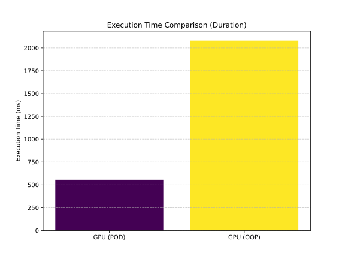
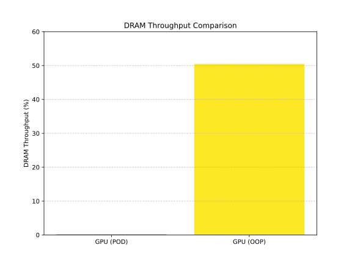
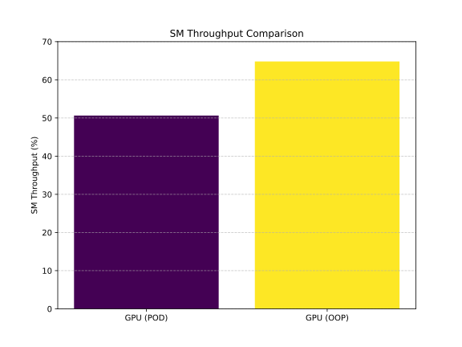

# Performance Analysis: A Comparative Study of GPU Implementations
This document presents a comparative analysis of the execution time for a ray tracing application on an NVIDIA GeForce RTX 3080 Ti.
The benchmark involved rendering a 1200 x 675 pixel image with `samples_per_pixel = 10` and `max_depth = 10`.
Due to profiler constraints, the kernel was run for a fixed duration to ensure accurate data collection.

The data unequivocally demonstrates the overwhelming performance advantage of a Plain Old Data (POD) based design over a traditional Object-Oriented Programming (OOP) approach.
While both implementations leverage the GPU's parallel processing capabilities, the POD version consistently delivered significantly faster render times, particularly at higher quality settings.

The key to this performance disparity lies not in the raw hardware, but in how each design paradigm interacts with the GPU's unique architecture.
As detailed in the following sections, the POD-based implementation successfully mitigates critical bottlenecks related to memory access and instruction-level overhead.
For a complete and unfiltered view of the performance data, refer to the raw log files provided in the appendix.

# Analysis of Key Performance Metrics
## Duration: The Primary Performance Metric
As shown in Fig. 1, the most direct measure of performance, execution time, reveals a staggering difference between the two implementations.
The POD-based version completed the rendering task in just 555.39 ms, whereas the OOP version took 2.08 seconds (2080 ms), making the POD implementation approximately 3.7 times faster.
This single metric highlights the profound impact that a well-optimized data layout and instruction flow can have on overall performance.

<figure style="padding: 15px; display: inline-block;">
  
  <figcaption style="text-align: center; margin-top: 10px; font-size: 0.9em; color: #555;">
    Fig. 1: GPU vs. GPU (POD) Execution Time
  </figcaption>
</figure>

## DRAM and SM Throughput: A Deeper Look
The raw throughput metrics, illustrated in Fig. 2 and Fig. 3, provide crucial insight into the root cause of this performance gap.
Fig. 2 illustrates the DRAM throughput, which is a key indicator of memory access efficiency.
The OOP implementation exhibits a high DRAM throughput of 50.48%, indicating frequent and costly access to global memory.
In stark contrast, the POD implementation's DRAM throughput is a mere 0.12%, demonstrating a near-complete elimination of this memory bottleneck.
This dramatic improvement is a direct result of the POD design's superior memory access locality, which is discussed in the appendix.

Conversely, Fig. 3 shows that the OOP implementation achieved a higher SM throughput (64.80%) compared to the POD version (50.63%).
This counterintuitive result highlights the fact that not all instructions contribute equally to the final computation.
The higher throughput in the OOP version is attributed to the redundant overhead of virtual function calls, which kept the SMs "busy" with non-productive work.
The POD version, by eliminating these overheads, executed a lower total number of instructions but completed the task far more efficiently.

<figure style="padding: 15px; display: inline-block;">
  
  <figcaption style="text-align: center; margin-top: 10px; font-size: 0.9em; color: #555;">
    Fig. 2: GPU vs. GPU (POD) DRAM Throughput
  </figcaption>
</figure>

<figure style="padding: 15px; display: inline-block;">
  
  <figcaption style="text-align: center; margin-top: 10px; font-size: 0.9em; color: #555;">
    Fig. 3: GPU vs. GPU (POD) SM Throughput
  </figcaption>
</figure>

# Conclusion
The performance analysis clearly demonstrates that the POD-based design is a superior approach for this ray tracing application.
The data provides a counterpoint to the common assumption that higher throughput metrics always indicate superior performance.
Instead, it underscores the critical importance of a holistic optimization strategy that prioritizes data locality and efficient instruction paths over raw compute or memory utilization.

# Appendix: Raw `ncu` Profiling Logs
This appendix contains the raw output from the NVIDIA Nsight Compute (`ncu`) profiler for both the OOP and POD GPU implementations. These logs provide a detailed, unfiltered view of the performance metrics discussed in this report, allowing for independent verification and further analysis.

## OOP Implementation
```txt
[18242] python3.10@127.0.0.1
  render (50, 43, 1)x(24, 16, 1), Context 1, Stream 7, Device 0, CC 8.6
    Section: GPU Speed Of Light Throughput
    ----------------------- ----------- -------------
    Metric Name             Metric Unit  Metric Value
    ----------------------- ----------- -------------
    DRAM Frequency                  Ghz          9.24
    SM Frequency                    Ghz          1.36
    Elapsed Cycles                cycle    2832566810
    Memory Throughput                 %         64.80
    DRAM Throughput                   %         50.48
    Duration                          s          2.08
    L1/TEX Cache Throughput           %         69.17
    L2 Cache Throughput               %         61.98
    SM Active Cycles              cycle 2786766130.84
    Compute (SM) Throughput           %         64.80
    ----------------------- ----------- -------------

    INF   Compute and Memory are well-balanced: To reduce runtime, both computation and memory traffic must be reduced.
          Check both the Compute Workload Analysis and Memory Workload Analysis sections.

    Section: Launch Statistics
    -------------------------------- --------------- ---------------
    Metric Name                          Metric Unit    Metric Value
    -------------------------------- --------------- ---------------
    Block Size                                                   384
    Function Cache Configuration                     CachePreferNone
    Grid Size                                                   2150
    Registers Per Thread             register/thread              50
    Shared Memory Configuration Size           Kbyte            8.19
    Driver Shared Memory Per Block       Kbyte/block            1.02
    Dynamic Shared Memory Per Block       byte/block               0
    Static Shared Memory Per Block        byte/block               0
    # SMs                                         SM              80
    Threads                                   thread          825600
    Uses Green Context                                             0
    Waves Per SM                                                8.96
    -------------------------------- --------------- ---------------

    Section: Occupancy
    ------------------------------- ----------- ------------
    Metric Name                     Metric Unit Metric Value
    ------------------------------- ----------- ------------
    Block Limit SM                        block           16
    Block Limit Registers                 block            3
    Block Limit Shared Mem                block            8
    Block Limit Warps                     block            4
    Theoretical Active Warps per SM        warp           36
    Theoretical Occupancy                     %           75
    Achieved Occupancy                        %        55.01
    Achieved Active Warps Per SM           warp        26.40
    ------------------------------- ----------- ------------

    OPT   Est. Local Speedup: 26.66%
          The difference between calculated theoretical (75.0%) and measured achieved occupancy (55.0%) can be the
          result of warp scheduling overheads or workload imbalances during the kernel execution. Load imbalances can
          occur between warps within a block as well as across blocks of the same kernel. See the CUDA Best Practices
          Guide (https://docs.nvidia.com/cuda/cuda-c-best-practices-guide/index.html#occupancy) for more details on
          optimizing occupancy.
    ----- --------------------------------------------------------------------------------------------------------------
    OPT   Est. Local Speedup: 25%
          The 9.00 theoretical warps per scheduler this kernel can issue according to its occupancy are below the
          hardware maximum of 12. This kernel's theoretical occupancy (75.0%) is limited by the number of required
          registers.

    Section: GPU and Memory Workload Distribution
    -------------------------- ----------- -------------
    Metric Name                Metric Unit  Metric Value
    -------------------------- ----------- -------------
    Average DRAM Active Cycles       cycle 9682972029.33
    Total DRAM Elapsed Cycles        cycle  230160135168
    Average L1 Active Cycles         cycle 2786766130.84
    Total L1 Elapsed Cycles          cycle  235320397710
    Average L2 Active Cycles         cycle 2694662011.71
    Total L2 Elapsed Cycles          cycle  131480983536
    Average SM Active Cycles         cycle 2786766130.84
    Total SM Elapsed Cycles          cycle  235320397710
    Average SMSP Active Cycles       cycle 2716537987.92
    Total SMSP Elapsed Cycles        cycle  941281590840
    -------------------------- ----------- -------------
```

## POD Implementation
```txt
[18674] python3.10@127.0.0.1
  render (50, 43, 1)x(24, 16, 1), Context 1, Stream 7, Device 0, CC 8.6
    Section: GPU Speed Of Light Throughput
    ----------------------- ----------- ------------
    Metric Name             Metric Unit Metric Value
    ----------------------- ----------- ------------
    DRAM Frequency                  Ghz         9.24
    SM Frequency                    Ghz         1.36
    Elapsed Cycles                cycle    758103720
    Memory Throughput                 %        50.63
    DRAM Throughput                   %         0.12
    Duration                         ms       555.39
    L1/TEX Cache Throughput           %        53.38
    L2 Cache Throughput               %         9.98
    SM Active Cycles              cycle 731424620.73
    Compute (SM) Throughput           %        50.63
    ----------------------- ----------- ------------

    OPT   This kernel exhibits low compute throughput and memory bandwidth utilization relative to the peak performance
          of this device. Achieved compute throughput and/or memory bandwidth below 60.0% of peak typically indicate
          latency issues. Look at Scheduler Statistics and Warp State Statistics for potential reasons.

    Section: Launch Statistics
    -------------------------------- --------------- ---------------
    Metric Name                          Metric Unit    Metric Value
    -------------------------------- --------------- ---------------
    Block Size                                                   384
    Function Cache Configuration                     CachePreferNone
    Grid Size                                                   2150
    Registers Per Thread             register/thread              80
    Shared Memory Configuration Size           Kbyte            8.19
    Driver Shared Memory Per Block       Kbyte/block            1.02
    Dynamic Shared Memory Per Block       byte/block               0
    Static Shared Memory Per Block        byte/block               0
    # SMs                                         SM              80
    Threads                                   thread          825600
    Uses Green Context                                             0
    Waves Per SM                                               13.44
    -------------------------------- --------------- ---------------

    Section: Occupancy
    ------------------------------- ----------- ------------
    Metric Name                     Metric Unit Metric Value
    ------------------------------- ----------- ------------
    Block Limit SM                        block           16
    Block Limit Registers                 block            2
    Block Limit Shared Mem                block            8
    Block Limit Warps                     block            4
    Theoretical Active Warps per SM        warp           24
    Theoretical Occupancy                     %           50
    Achieved Occupancy                        %        32.70
    Achieved Active Warps Per SM           warp        15.69
    ------------------------------- ----------- ------------

    OPT   Est. Local Speedup: 34.61%
          The difference between calculated theoretical (50.0%) and measured achieved occupancy (32.7%) can be the
          result of warp scheduling overheads or workload imbalances during the kernel execution. Load imbalances can
          occur between warps within a block as well as across blocks of the same kernel. See the CUDA Best Practices
          Guide (https://docs.nvidia.com/cuda/cuda-c-best-practices-guide/index.html#occupancy) for more details on
          optimizing occupancy.
    ----- --------------------------------------------------------------------------------------------------------------
    OPT   Est. Local Speedup: 50%
          The 6.00 theoretical warps per scheduler this kernel can issue according to its occupancy are below the
          hardware maximum of 12. This kernel's theoretical occupancy (50.0%) is limited by the number of required
          registers.

    Section: GPU and Memory Workload Distribution
    -------------------------- ----------- ------------
    Metric Name                Metric Unit Metric Value
    -------------------------- ----------- ------------
    Average DRAM Active Cycles       cycle      6217692
    Total DRAM Elapsed Cycles        cycle  61599698944
    Average L1 Active Cycles         cycle 731424620.73
    Total L1 Elapsed Cycles          cycle  61686312416
    Average L2 Active Cycles         cycle 252850679.15
    Total L2 Elapsed Cycles          cycle  35189364720
    Average SM Active Cycles         cycle 731424620.73
    Total SM Elapsed Cycles          cycle  61686312416
    Average SMSP Active Cycles       cycle 674291178.16
    Total SMSP Elapsed Cycles        cycle 246745249664
    -------------------------- ----------- ------------

    OPT   Est. Speedup: 8.483%
          One or more SMSPs have a much lower number of active cycles than the average number of active cycles. Maximum
          instance value is 9.70% above the average, while the minimum instance value is 14.04% below the average.
    ----- --------------------------------------------------------------------------------------------------------------
    OPT   Est. Speedup: 14.92%
          One or more L2 Slices have a much lower number of active cycles than the average number of active cycles.
          Maximum instance value is 43.26% above the average, while the minimum instance value is 94.17% below the
          average.
```